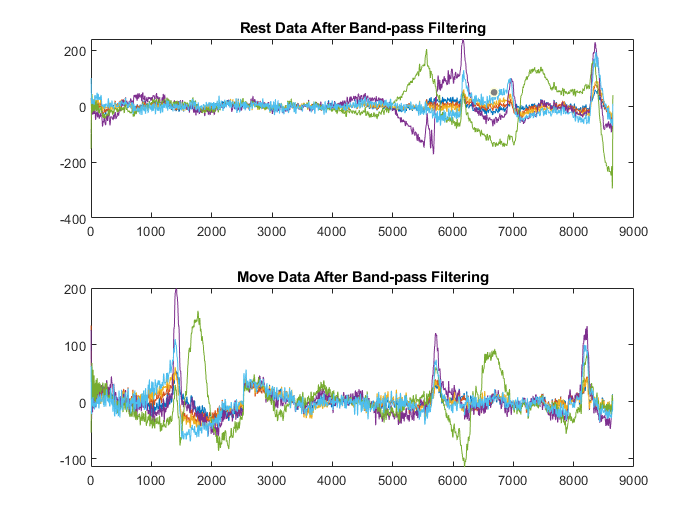
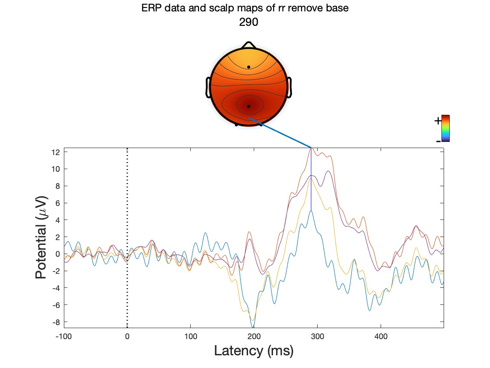
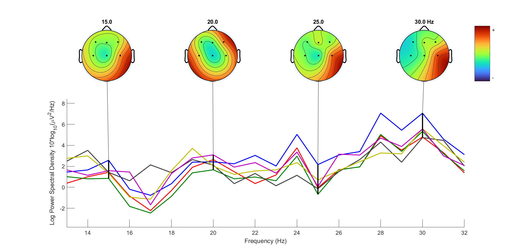
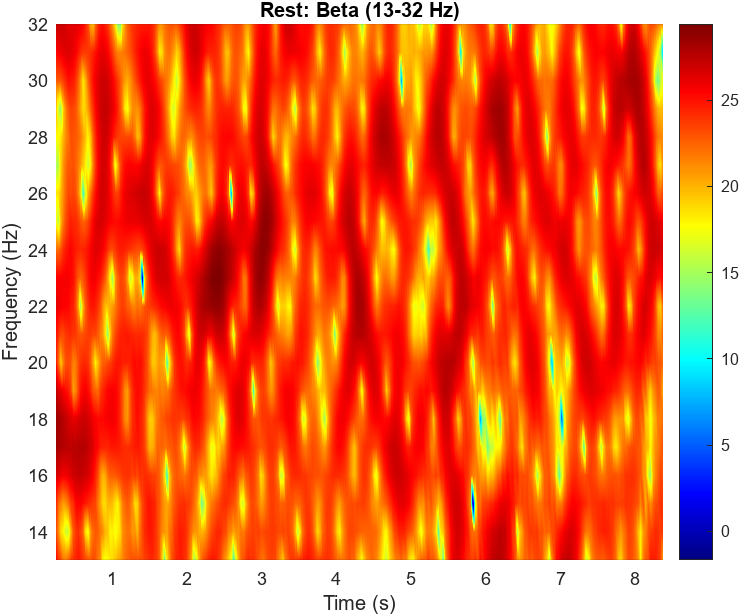
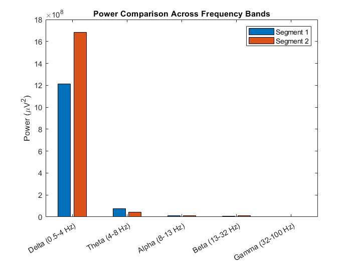

# Neural Engineering EEG Analysis

This repository contains MATLAB-based coursework for EEG signal preprocessing, ERP analysis, and spectral analysis in a neural engineering course.

## Overview

The scripts in this repository focus on practical EEG data processing workflows, including signal preprocessing, event-based segmentation, ERP analysis, time-frequency visualization, and frequency-band power comparison.

## Example Results

### EEG Preprocessing

The preprocessing pipeline includes mean removal, detrending, 60 Hz notch filtering, and band-pass filtering (0.5–50 Hz) to remove noise and baseline drift in EEG signals.



---

### Event-Related Potential (ERP)

Average ERP waveforms illustrating neural responses following stimulus onset.



---

### Spatial Distribution of Spectral Activity

Scalp topography visualization showing spatial distribution of EEG spectral power across electrodes.



---

### Time-Frequency Analysis

Short-time Fourier transform (STFT) spectrogram illustrating temporal changes in EEG beta-band activity.



---

### Frequency Band Power Comparison

Comparison of EEG power across classical frequency bands (Delta, Theta, Alpha, Beta, Gamma).



## Topics Covered

- EEG data import from CSV files
- Event-based signal segmentation
- Mean removal and detrending
- 60 Hz notch filtering
- 0.5–50 Hz band-pass filtering
- Power spectral density (PSD) analysis
- FFT-based frequency analysis
- Short-Time Fourier Transform (STFT) / spectrogram visualization
- ERP analysis
- P1, N1, and P300 peak detection
- Target vs non-target ERP comparison
- Frequency-band power comparison
- EEGLAB dataset conversion and export

## Included Assignments

### HW3 — EEG Preprocessing and Spectral Analysis
This script demonstrates core EEG preprocessing steps and compares signals before and after filtering.

Main tasks:
- Import EEG data and event markers
- Extract task-related signal segments
- Mean removal and detrending
- 60 Hz notch filtering
- 0.5–50 Hz band-pass filtering
- Welch PSD analysis
- FFT-based spectrum comparison
- Multi-channel frequency-domain visualization

### HW4 — ERP Analysis with EEGLAB
This script converts CSV data into EEGLAB format and performs ERP analysis.

Main tasks:
- Import CSV data into EEGLAB structure
- Define events and create epochs
- Apply band-pass filtering and baseline correction
- Compute average ERP
- Identify P1, N1, and P300 peaks
- Compare target vs non-target ERP responses
- Save processed datasets and figures

### HW5 — Rest vs Movement EEG Analysis
This script compares EEG signals between rest and movement conditions.

Main tasks:
- Segment EEG data into rest and movement intervals
- Apply preprocessing pipeline
- Perform STFT-based time-frequency analysis
- Compare frequency-band power between rest and movement
- Export processed EEG data to EEGLAB format

### HW6 — Baseline Interval Comparison
This script compares two EEG baseline intervals using time-frequency and band-power analysis.

Main tasks:
- Extract baseline intervals based on event markers
- Apply preprocessing pipeline
- Generate STFT visualizations
- Compute frequency-band power
- Compare power across EEG bands
- Export processed datasets for EEGLAB

## Frequency Bands

The following EEG frequency bands are analyzed in several scripts:

- Delta (0.5–4 Hz)
- Theta (4–8 Hz)
- Alpha (8–13 Hz)
- Beta (13–32 Hz)
- Gamma (32–100 Hz)

## Tools

- MATLAB
- Signal Processing Toolbox
- EEGLAB

## Suggested Repository Structure

```text
neural-engineering-eeg-analysis/
├── HW3.m
├── HW4.m
├── HW5.m
├── HW6.m
├── README.md
└── figures/
